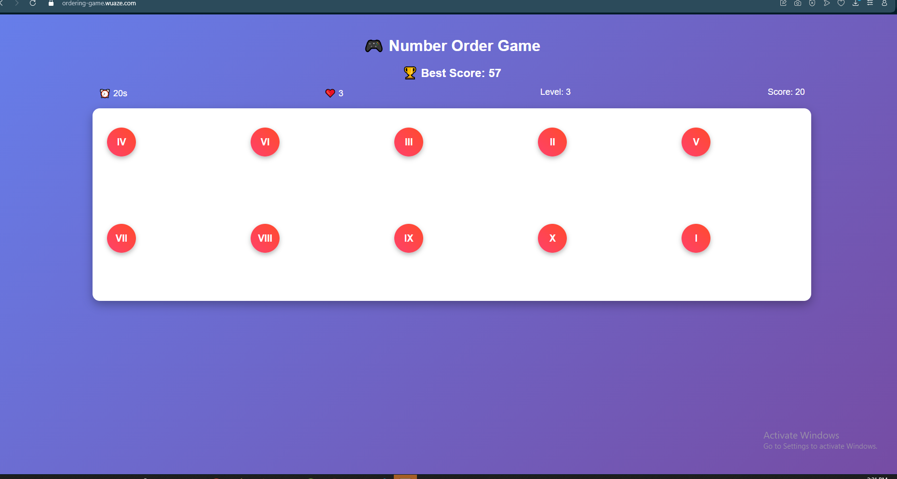
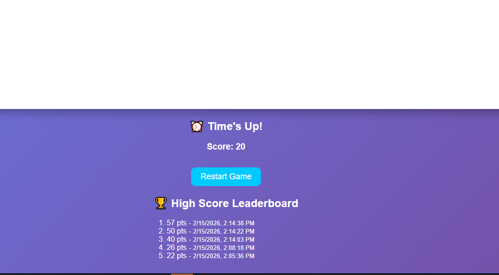
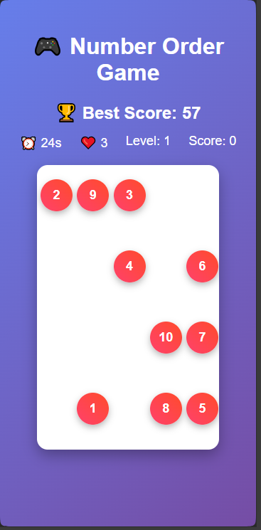

# 🎮 React Number Ordering Game

A fun and interactive React game where players must click numbers in order as fast as possible.  
Includes **Roman numerals** at higher levels, countdown timer, lives, sounds, and a high-score leaderboard.

---

## 🎬 Screenshots

<p align="center">
  
  
  
  

</p>
---

## 🚀 Play Online

You can play the game live here: [Play Number Ordering Game Online](https://ordering-game.wuaze.com/)  

> Replace the URL with your actual GitHub Pages URL.

---

## 🕹 Features

- Numbers appear randomly on the screen
- Click numbers in order from 1 → 10
- Countdown timer and limited lives
- Wrong clicks shake the number and flash screen
- Fade-out animation for correct clicks
- Levels increase difficulty
- Roman numerals from level 3 onwards
- High-score leaderboard stored in local storage
- Success, error, and level-complete sounds
- Responsive layout for desktop and mobile

---

## ⚡ Installation (Local)

1. Clone the repository:

```bash
git clone https://github.com/seifeakalu/ReactNumberOrderingGame.git
